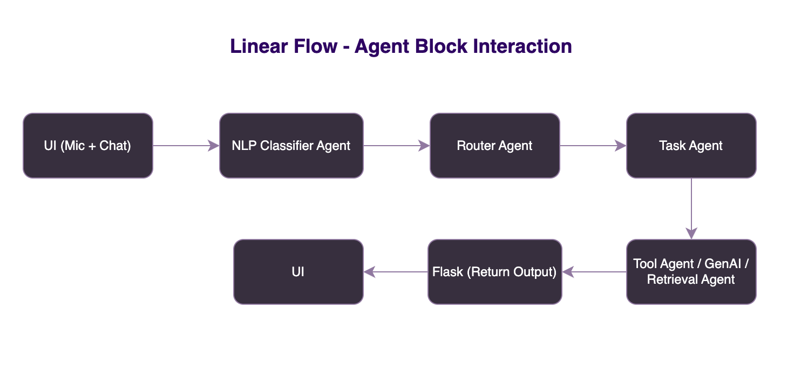

# Multi-Agent Chatbot Architecture

## Goal
An intelligent, voice-enabled conversational assistant using a modular multi-agent architecture to handle:
- Natural language queries
- Intent routing
- Task execution (bookings/info)
- Voice input & sentiment understanding

---
## 🧭 System Architecture

## System Overview

### Level 0: **User Interaction Layer**
- Input via text or speech (Whisper / Google STT)
- Mic + Chat UI (HTML, JS, CSS)
- Handles human-in-loop recovery (e.g., “missing date?”)

### Level 1: **Execution Controller**
- Agent Supervisor (LangGraph)
- Maintains state, error handling, retry logic
- Directs flow across layers

### Level 2: **Intent Routing**
- NLP Classifier Agent (Zero-shot / regex)
- Router Agent (LangGraph)
- Distinguishes between classification (what?) and routing (now what?)

### Level 3: **Task Management**
- Task Agent: breaks complex queries into subtasks
- Critic Agent: evaluates LLM outputs for quality/safety

### Level 4: **Execution Layer**
- GenAI Agent: LLM-based response generation (OpenAI)
- Knowledge Agent: RAG (retrieval + gen)
- Tool Agents: API calls (e.g., bookings, cancellations)
- Retrieval Agent: vector search or FAQ doc lookup

---

## Technologies

| Component       | Tech Used                         |
|----------------|------------------------------------|
| Frontend        | HTML, CSS, JS                     |
| Backend         | Flask                             |
| Voice Input     | Whisper / Google STT              |
| Sentiment       | VADER / HuggingFace Transformers  |
| Multi-Agent     | LangGraph, Microsoft AutoGen      |
| GenAI           | OpenAI GPT-4                      |

---

## Data Flow (Example)

1. User: “Book a hotel in Bali next weekend”
2. UI sends query → Flask backend
3. Supervisor routes to NLP Classifier → detects `book_intent`
4. Router Agent chooses `Task Agent`
5. Task Agent → Tool Agent (Booking) → API call simulated
6. Critic Agent reviews output
7. Response sent back to UI

---

## Future Improvements
- Real-time speech streaming
- Multi-language support
- Real booking API integration

